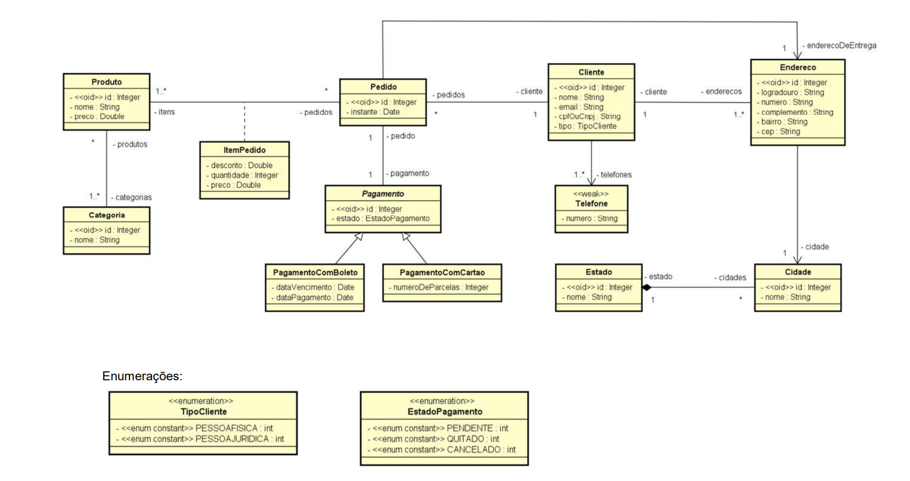
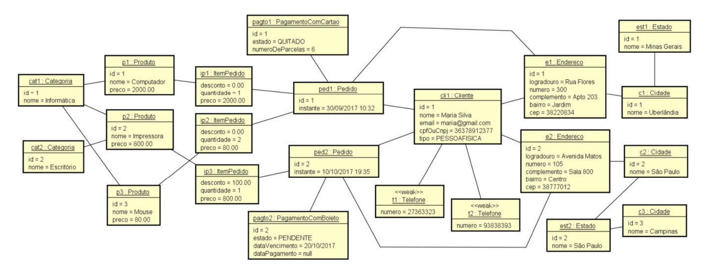
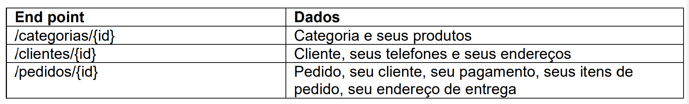

# Estudo de caso: implementação Java com Spring Boot e JPA

## Objetivo geral:

    Este estudo de caso tem como objetivo mostrar na prática como um modelo conceitual pode ser implementado
sobre o paradigma orientado a objetos, usando padrões de mercado e boas práticas.

    Vamos tomar como caso um modelo conceitual abrangente, com o qual possamos mostrar a implementação prática
em linguagem orientada a objetos dos tópicos aprendidos no curso, quais sejam:

- Leitura e entendimento do diagrama de classes
- Leitura e entendimento do diagrama de objetos
- Associações
- Um para muitos / muitos para um
- Um para um
- Muitos para muitos
- Conceito dependente
- Classe de associação
- Herança
- Enumerações
- Tipos primitivos (ItemPedidoPK)
- Entidades fracas (ElementCollection)
- Associações direcionadas

## Objetivos específicos:

1 - Fazer uma implementação padrão do seguinte modelo conceitual:

2 - Criar a seguinte instância do modelo conceitual:

3 - Recuperar os dados e disponibilizá-los por meio de uma API Rest BÁSICA. Os seguintes end points devem ser disponibilizados:

